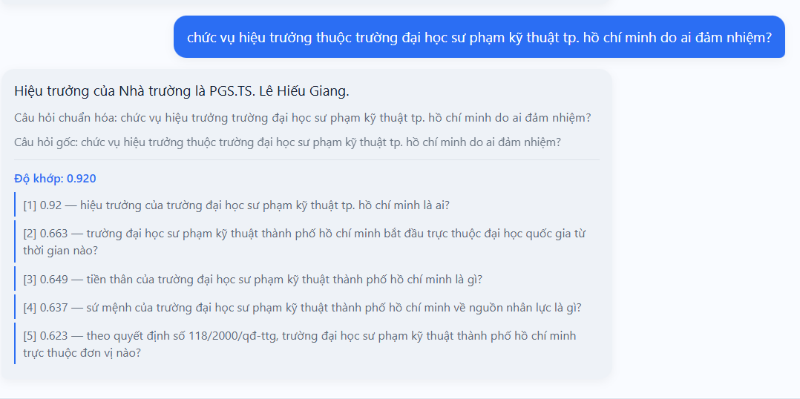
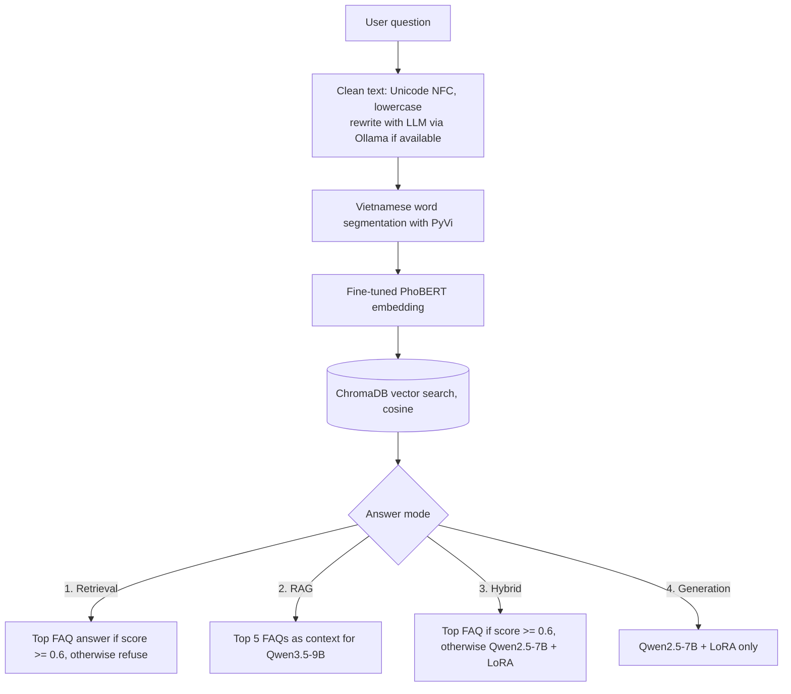
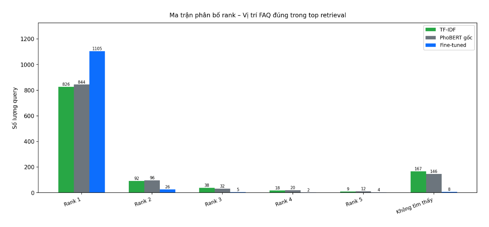

# Vietnamese FAQ Chatbot for HCM-UTE Students

A question-answering system that helps students of Ho Chi Minh City University of Technology and Engineering (HCM-UTE) find answers from the 2025 Student Handbook. It uses a fine-tuned PhoBERT model to find the most relevant FAQ, and can use an LLM (Qwen) to write the answer.

This is a course project for Natural Language Processing at HCM-UTE (team of 3, 2026). The full report is in Vietnamese: [Nhom02_NLP_BAOCAO_final.pdf](Nhom02_NLP_BAOCAO_final.pdf).

Trained models on Hugging Face: [phobert-hcmute-faq-retrieval](https://huggingface.co/TicassloThang/phobert-hcmute-faq-retrieval) (retrieval) and [qwen2.5-7b-hcmute-faq-lora](https://huggingface.co/TicassloThang/qwen2.5-7b-hcmute-faq-lora) (LoRA adapter).



## Overview

- Built a dataset of 1,148 question-answer pairs from the handbook, then used Qwen3.5-9B (via Ollama) to generate 10,502 paraphrased questions for training.
- Fine-tuned PhoBERT for semantic search. On 1,150 test questions from FAQs not seen during training, it ranks the correct FAQ first 96.1% of the time, compared to 71.8% for TF-IDF and 73.4% for the original PhoBERT.
- Fine-tuned Qwen2.5-7B-Instruct with LoRA on a 4-bit base model (0.53% of parameters trained) on a single T4 GPU.
- Split train, validation and test sets by FAQ group, so all paraphrases of the same question stay in the same set and test results are not inflated.
- Built a Flask web app with 4 answer modes: retrieval only, RAG, hybrid and generation only.

## How it works



| Mode | What it does |
|---|---|
| 1. Retrieval | Returns the original FAQ answer when the cosine similarity is at least 0.6. Otherwise it says it cannot answer. |
| 2. RAG | Sends the top 5 FAQs to Qwen3.5-9B (Ollama) and asks it to answer using only that information. |
| 3. Hybrid | Uses the FAQ answer when the score is high enough, and falls back to the fine-tuned Qwen2.5-7B when it is not. |
| 4. Generation | Uses only the fine-tuned Qwen2.5-7B, without retrieval. |

## Results

### Retrieval

Test set: 1,150 paraphrased questions from unseen FAQs, searched against all 1,148 FAQs.

| Metric | TF-IDF | PhoBERT (original) | PhoBERT (fine-tuned) |
|---|---|---|---|
| Precision@1 | 71.83% | 73.39% | 96.09% |
| Precision@3 | 83.13% | 84.52% | 98.78% |
| Precision@5 | 85.48% | 87.30% | 99.30% |
| Not in top 5 | 167 | 146 | 8 |
| Similarity margin (correct minus wrong) | - | 0.188 | 0.757 |



After fine-tuning with MultipleNegativesRankingLoss, the average similarity to the correct FAQ goes down a little (0.88 to 0.82), but the similarity to wrong FAQs goes down much more (0.70 to 0.06). The bigger gap between them is what makes the ranking more accurate.

### Answer generation (Qwen2.5-7B-Instruct + LoRA)

| Setting | Value |
|---|---|
| Base model | unsloth/Qwen2.5-7B-Instruct-bnb-4bit |
| LoRA | r=16, alpha=16, dropout=0.05, applied to attention and MLP layers |
| Trainable parameters | 40.4M of 7.66B (0.53%) |
| Data split (by FAQ group) | 10,472 train, 587 validation, 591 test |
| Training | batch size 8 (2 x 4 gradient accumulation), AdamW 8-bit, learning rate 2e-4 with warmup and cosine decay, early stopping; best checkpoint at step 300 |
| Hardware | 1 NVIDIA T4 16GB on Google Colab, about 70 minutes |
| Test results | loss 0.988, corpus BLEU-4 4.89 |

## Limitations

- In hybrid mode, questions with a low score are sent to Qwen without any FAQ context, so it can make things up. For example, when asked about today's weather, modes 1 and 2 refuse correctly, but mode 3 invents a forecast. Always giving the model retrieved FAQs, or refusing below a minimum score, would fix this.
- The generation model on its own is weak (BLEU-4 around 4.9). Its answers read well but are sometimes too general or not exact.
- The 0.6 threshold was set by hand and was not tuned on the validation set.
- Some LLM-generated paraphrases are low quality, and the data only covers the 2025 handbook. The university was renamed after that, so the data still uses the old name.

## Tech stack

Python, PyTorch, Hugging Face Transformers, Sentence-Transformers, PhoBERT (vinai/phobert-base-v2), PyVi, ChromaDB, Qwen2.5, PEFT (LoRA), Unsloth, TRL, bitsandbytes, Ollama, scikit-learn, Flask, HTML/CSS/JavaScript

## Project structure

```
NLP_DoAn/
├── app.py                    # Flask web app (port 8080)
├── demo.py                   # Retrieval, answer modes, LLM calls; also runs as a CLI demo
├── train_phobert_faq.py      # Fine-tune and evaluate PhoBERT (with TF-IDF and original PhoBERT baselines)
├── finetune_mauV2.ipynb      # Fine-tune Qwen2.5-7B with LoRA on Google Colab
├── finetune_qwen257B.jsonl   # Question-answer data for Qwen
├── FAQ_HCMUTE_preprocessed.csv
├── templates/, static/       # Web interface used by Flask
├── frontend/                 # Standalone static interface (calls /chat)
└── Data/
    ├── Prepare/                      # Original FAQ and first paraphrase set
    ├── preprocessing_data/           # Text cleaning scripts
    ├── Generate_data/                # Paraphrase generation with Ollama
    └── After_Processing_Paraphrase/  # Final 10,502 training pairs
```

## Run locally

1. Install the dependencies:

```bash
cd NLP_DoAn
python -m venv .venv
.venv\Scripts\activate
pip install -r requirements.txt
```

On Linux or macOS, activate with `source .venv/bin/activate`.

2. Download the trained models from Hugging Face into `NLP_DoAn/`:

```bash
hf download TicassloThang/phobert-hcmute-faq-retrieval --local-dir phobert_faq_retrieval
hf download TicassloThang/qwen2.5-7b-hcmute-faq-lora --local-dir qwen25_7b_instruct_lora_best
```

The first one is needed for all modes, the second only for modes 3 and 4. The `hf` command comes with `pip install huggingface_hub`. The same models are also on [Google Drive](https://drive.google.com/drive/folders/1gjc2Z9rFAPeJAw2zVrQi7U_tLqL5qEsh?usp=sharing).

3. Optional: start Ollama for question rewriting and mode 2.

```bash
ollama run qwen3.5:9b
```

4. Start the web app and open http://127.0.0.1:8080

```bash
python app.py
```

Modes 3 and 4 need an NVIDIA GPU because the 7B model is loaded in 4-bit.

To train again: run `python train_phobert_faq.py` for PhoBERT, and open `finetune_mauV2.ipynb` on Google Colab (T4) for Qwen.

## Team

- Huỳnh Thanh Nhân
- Trương Tấn Sang
- Huỳnh Ngọc Thắng

We worked on all parts together, from collecting the data to training the models and writing the report.

## Acknowledgements

- FAQ data from the HCM-UTE 2025 Student Handbook (published 03/10/2025).
- [PhoBERT](https://github.com/VinAIResearch/PhoBERT) by VinAI Research, [Qwen2.5](https://github.com/QwenLM/Qwen2.5) by Alibaba Cloud, [Unsloth](https://github.com/unslothai/unsloth).

## License

[MIT](LICENSE)
